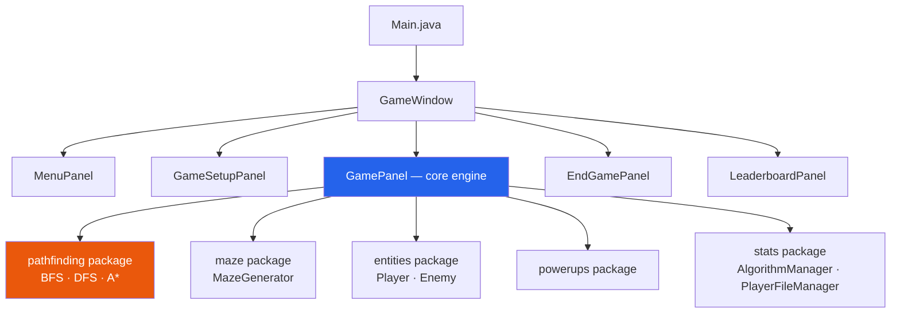
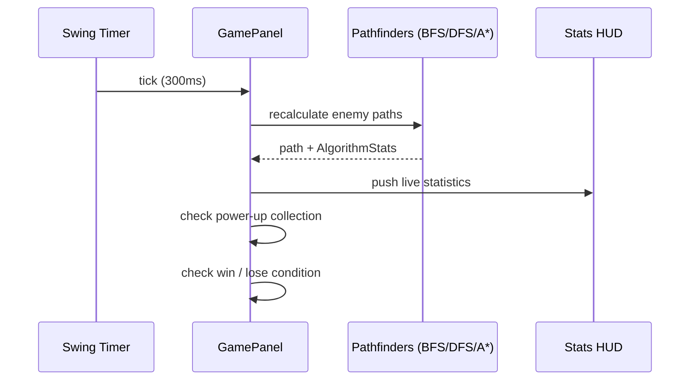

<div align="center">

# 🏰 AI Dungeon Escape Simulator

### A Real-Time Graph Traversal & Pathfinding Game Engine

*Data Structures & Algorithms Lab Project — University of Central Punjab*

[](#)
[](#)
[](#)
[](#)
[](#)

[](#-algorithms--complexity)
[](#-data-structures-used)
[](#-project-structure)
[](#-project-structure)
[](#-difficulty-system)

[](#bfs--breadth-first-search)
[](#dfs--depth-first-search)
[](#a--a-star-search)

</div>

---

## 📑 Table of Contents

<details open>
<summary>Click to expand / collapse</summary>

- [Overview](#-overview)
- [Project Highlights](#-project-highlights)
- [Technical Stack](#-technical-stack)
- [System Architecture](#-system-architecture)
- [Project Structure](#-project-structure)
- [Algorithms & Complexity](#-algorithms--complexity)
- [Data Structures Used](#-data-structures-used)
- [Performance: Real Benchmark Data](#-performance-real-benchmark-data)
- [Difficulty System](#-difficulty-system)
- [Power-Ups](#-power-ups)
- [Scoring & Leaderboard](#-scoring--leaderboard)
- [Controls](#-controls)
- [Getting Started](#-getting-started)
- [Code Quality](#-code-quality)
- [Challenges & Solutions](#-challenges--solutions)
- [Future Work](#-future-work)
- [Author](#-author)

</details>

---

## 🎮 Overview

**AI Dungeon Escape Simulator** is a real-time, interactive Java game built to demonstrate practical, working implementations of classic graph traversal algorithms. Instead of running algorithms on static input, this project embeds **BFS**, **DFS**, and **A\* Search** directly into live AI enemy behavior, chasing the player through a procedurally generated 25×21 maze.

Beyond the algorithmic core, the project includes a full game engine: a Swing-based GUI, a power-up system, a persistent leaderboard, a stack-based undo mechanic, and an in-game **algorithm statistics HUD** that lets players watch BFS, DFS, and A* compete in real time — nanosecond by nanosecond.

> The player starts at the top-left corner `(1,1)` and must reach the goal at the bottom-right `(23,19)` before being caught.

## ⭐ Project Highlights

| Metric | Value |
|---|---|
| Pathfinding Algorithms | 3 (BFS, DFS, A*) |
| Data Structures | 7+ |
| Java Packages | 8 |
| Source Files | 23 |
| Difficulty Levels | 3 |
| Maze Size | 25 × 21 grid (525 cells) |
| Game Loop Tick Rate | 300 ms |
| Persistence | File-based (`players.txt`, `algorithm_stats.txt`) |

## 🛠 Technical Stack

| Technology | Details |
|---|---|
| **Language** | Java (JDK 11+) |
| **GUI Framework** | Java Swing (`JPanel`, `JFrame`, `CardLayout`, `Timer`) |
| **Build / IDE** | IntelliJ IDEA (`.iml` module configuration) |
| **Data Persistence** | Flat-file text I/O (`players.txt`, `algorithm_stats.txt`) |
| **Version Control** | Git |

## 🏗 System Architecture

The application follows a `CardLayout`-driven screen flow, with `GamePanel` acting as the central engine that coordinates pathfinding, entities, power-ups, and stats.



<details>
<summary>🔄 Game loop sequence (every 300ms tick)</summary>



</details>

## 📁 Project Structure

```
src/
├── Main.java                          # Entry point
├── game/                               # UI layer, game loop, rendering
│   ├── GameWindow.java
│   ├── GamePanel.java                  # 24,697 bytes — core engine
│   ├── MenuPanel.java
│   ├── GameSetupPanel.java
│   ├── EndGamePanel.java
│   └── LeaderboardPanel.java
├── pathfinding/                        # Core algorithm implementations
│   ├── BFSPathFinder.java
│   ├── DFSPathFinder.java
│   ├── AStarPathFinder.java
│   ├── AStarNode.java
│   └── Node.java
├── maze/
│   └── MazeGenerator.java              # Recursive backtracking maze gen
├── entities/                            # OOP entity hierarchy
│   ├── Entity.java
│   ├── Player.java
│   ├── Enemy.java
│   └── EnemyType.java
├── powerups/
│   ├── PowerUp.java
│   └── PowerUpType.java
├── stats/                               # Benchmarking & persistence
│   ├── AlgorithmStats.java
│   ├── AlgorithmManager.java
│   └── PlayerFileManager.java
└── difficulty/
    └── Difficulty.java
```

## 🧠 Algorithms & Complexity

<details>
<summary><b>BFS — Breadth-First Search</b> (click to expand)</summary>

Iterative, queue-based traversal. Guarantees the shortest path — making the BFS enemy the most relentless pursuer.

- Uses a `Queue<Node>` (`LinkedList`), a `boolean[][]` visited grid, and a `Node[][]` parent array for path reconstruction
- Explores level by level until the player's position is dequeued
- **Time:** `O(V + E)` · **Space:** `O(V)`

</details>

<details>
<summary><b>DFS — Depth-First Search</b></summary>

Recursive traversal that dives deep along the first valid branch before backtracking — producing erratic, often much longer paths.

- Uses the implicit call stack plus a `boolean[][]` visited array
- Not guaranteed optimal; real data shows DFS paths can be more than double BFS's optimal length
- **Time:** `O(V + E)` worst case · **Space:** `O(V)` call stack

</details>

<details>
<summary><b>A* — A-Star Search</b></summary>

Best-first search using `f = g + h`, with **Manhattan distance** as an admissible heuristic. Matches BFS's optimal path length while visiting far fewer nodes.

- Uses a `PriorityQueue<AStarNode>` (min-heap by `f`) and a `HashSet<String>` closed list
- **Time:** `O(V log V)` · **Space:** `O(V)`

</details>

<details>
<summary><b>Recursive Backtracking — Maze Generation</b></summary>

Generates a perfect, fully-connected maze on a 25×21 grid using 2-step DFS jumps, then opens ~25% of remaining walls (`addExtraPaths()`) to add loops and route variety.

</details>

### Theoretical Comparison

| Property | BFS | DFS | A* |
|---|---|---|---|
| Time Complexity | O(V + E) | O(V + E) | O(V log V) |
| Space Complexity | O(V) | O(V) call stack | O(V) |
| Optimality | ✅ Shortest path | ❌ First path found | ✅ Optimal (admissible h) |
| Completeness | ✅ | ✅ | ✅ |
| Heuristic | None | None | Manhattan Distance |
| Traversal Style | Level by level | Deep before wide | Best-first (lowest f) |
| Underlying Structure | Queue (FIFO) | Call Stack | Priority Queue (min-heap) |
| Enemy Behavior | Steady, relentless | Erratic, winding | Fast, optimal |

## 🗃 Data Structures Used

| Data Structure | Java Class | Used In | Purpose |
|---|---|---|---|
| 2D Array | `int[][]` | MazeGenerator, GamePanel | Maze grid (0=path, 1=wall) |
| Queue | `LinkedList<Node>` | BFSPathFinder | FIFO traversal frontier |
| Stack | `Stack<Node>` | GamePanel | Move history for Undo (Z) |
| Priority Queue | `PriorityQueue<AStarNode>` | AStarPathFinder | A* open list (min-heap by f) |
| Hash Set | `HashSet<String>` | AStarPathFinder | A* closed list, O(1) lookup |
| Tree Map | `TreeMap<Integer,String>` | GamePanel | Auto-sorted leaderboard |
| Tree Set | `TreeSet<PowerUpType>` | GamePanel | Collected power-up types |
| Array List | `ArrayList<...>` | All pathfinders, GamePanel | Dynamic paths & entity lists |
| Hash Map | `HashMap<String,String[]>` | PlayerFileManager | Player → [score, games, time] |
| Boolean 2D Array | `boolean[][]` | All pathfinders | Visited-cell tracking |

## 📊 Performance: Real Benchmark Data

Captured live from `algorithm_stats.txt` across real gameplay sessions (P = path length, V = nodes visited, T = execution time):

| Session | BFS (P / V / T ns) | DFS (P / V / T ns) | A* (P / V / T ns) |
|---|---|---|---|
| 1 | 23.06 / 233 / 372,686 | 55.33 / 216 / 98,603 | 23.06 / 75 / 529,953 |
| 2 | 20.50 / 194 / 301,633 | 27.45 / 31 / 23,715 | 20.50 / 55 / 373,443 |
| 3 | 20.50 / 184 / 223,108 | 25.18 / 28 / 20,911 | 20.50 / 56 / 288,034 |
| 4 | 20.21 / 183 / 166,575 | 50.70 / 87 / 29,049 | 19.68 / 58 / 258,030 |

**Key takeaways:**
- 🟦 **BFS** visits the most nodes (~183–233) — thorough but not efficient
- 🟩 **DFS** is fastest in raw execution time (~21K–100K ns) but produces erratic, often much longer paths
- 🟧 **A\*** visits the fewest nodes (~55–75) while matching BFS's optimal path length — confirming its efficiency advantage, at the cost of more execution time due to heap operations

<details>
<summary>📈 Danger ranking summary</summary>

| Metric | BFS | DFS | A* |
|---|---|---|---|
| Path Optimality | OPTIMAL | NOT OPTIMAL | OPTIMAL |
| Avg. Nodes Visited | HIGH | VARIABLE | LOW |
| Avg. Execution Time | MEDIUM | FAST | SLOW |
| Predictability | High (steady) | Low (erratic) | High (smart) |
| Danger to Player | HIGH | MEDIUM | **HIGHEST** |

</details>

## 🎯 Difficulty System

| Difficulty | Enemies Present | Challenge |
|---|---|---|
| 🟢 EASY | 1 — BFS only (starts at goal) | Outmaneuverable with basic spatial awareness |
| 🟡 MEDIUM | 2 — BFS + DFS (flanking angles) | DFS attacks from a different direction |
| 🔴 HARD | 3 — BFS + DFS + A* | Near-inescapable pursuit |

## ⚡ Power-Ups

| Power-Up | Color | Effect |
|---|---|---|
| FREEZE_ENEMY | Cyan | Stops all enemy movement for 5 seconds |
| PHASE_WALL | Magenta | Lets the player walk through walls for 5 seconds |

Spawned at random valid positions at game start; collecting one grants **+5 score**.

## 🏆 Scoring & Leaderboard

- **Base score:** seconds survived
- **+5** per power-up collected
- **+10** bonus on successful escape
- Persisted to `players.txt` as `Name,BestScore,TotalGames,TotalTimeSeconds`, sorted descending via a custom `Comparator`

<details>
<summary>Sample leaderboard data</summary>

| Player | Best Score | Total Games | Total Time (s) |
|---|---|---|---|
| roh | 57 | 41 | 1827 |
| ahmad | 38 | 3 | 57 |
| Player (default) | 8 | 2 | 14 |

</details>

## 🎹 Controls

| Key | Action |
|---|---|
| `W A S D` / Arrow Keys | Move player |
| `Z` | Undo last move |
| `R` | Restart game |
| `ESC` | Pause |
| `H` | Toggle stats HUD |
| `M` | Return to main menu |

The algorithm stats HUD is also **drag-and-drop repositionable** with the mouse.

## 🚀 Getting Started

```bash
# Clone the repository
git clone <your-repo-url>
cd ai-dungeon-escape-simulator

# Option 1 — Open in IntelliJ IDEA
# File → Open → select the project folder → Run Main.java

# Option 2 — Compile and run from the command line
javac -d out $(find src -name "*.java")
java -cp out Main
```

**Requirements:** JDK 11 or later.

## ✅ Code Quality

<details open>
<summary><b>Strengths</b></summary>

- ✅ Clear, package-based modular structure with single-responsibility design
- ✅ Consistent naming conventions (camelCase methods, PascalCase classes)
- ✅ Proper encapsulation with private fields and public getters
- ✅ Enums used for `EnemyType` and `Difficulty` — no magic strings
- ✅ `AlgorithmStats` copied (not referenced) when stored in history, avoiding shared mutable state
- ✅ Safe iterator-based power-up removal (no `ConcurrentModificationException`)
- ✅ Timer-based game loop correctly started/stopped on screen transitions

</details>

<details>
<summary><b>Areas for Improvement</b></summary>

- ⚠️ `Enemy` doesn't extend `Entity` — minor OOP hierarchy inconsistency
- ⚠️ Image paths are hardcoded relative strings — should use `ClassLoader` resource loading
- ⚠️ No null checks on image loads — missing assets fail silently
- ⚠️ `GamePanel` is too large (~700 lines) — rendering/input/logic should be split further
- ⚠️ A* closed list uses `String` keys (`"x,y"`) — a custom object with `hashCode`/`equals` would be more efficient
- ⚠️ DFS is recursive — risks `StackOverflowError` on very large mazes
- ⚠️ `PlayerFileManager` doesn't close `BufferedReader` on exception (resource leak)

</details>

## 🧩 Challenges & Solutions

| Challenge | Solution |
|---|---|
| Path recalculation every 300ms is expensive | History capped at 500 entries; only lightweight averages stored |
| Enemy spawning blocks the maze exit | Enemy's start tile is forced passable |
| Power-up removal during iteration | `Iterator.remove()` used for safe in-loop removal |
| HUD overlapping the game view | Made draggable via `MouseListener`, toggleable with `H` |
| Maze must always be solvable | Recursive backtracking guarantees full connectivity |
| Multiple screens in one window | `CardLayout` manages all 5 screens in a single `JFrame` |
| Player trail visual effect | Last 6 positions stored in `ArrayList`, drawn with decreasing alpha |
| Goal pulse animation without an extra timer | `Math.sin(System.currentTimeMillis()/200.0)` |

## 🔮 Future Work

- [ ] Fog of War — reveal tiles only within the player's view radius
- [ ] Aggressive/defensive AI modes with dynamic switching
- [ ] Multiplayer support — two players, same maze
- [ ] Animated sprite-sheet characters
- [ ] Sound effects for movement, power-ups, and events
- [ ] Dijkstra's Algorithm as a fourth enemy type
- [ ] Iterative DFS to remove stack-overflow risk
- [ ] Configurable maze density, size, and loop percentage

## 👤 Author

**Rohullah**
Department of Computer Science, University of Central Punjab
Data Structures & Algorithms Lab — Spring 2026

---

<div align="center">

*This project was developed as an academic DSA lab submission. No open-source license has been applied to the source code — please contact the author regarding reuse.*

⭐ If this project helped you understand BFS/DFS/A* in action, consider starring the repo!

</div>
